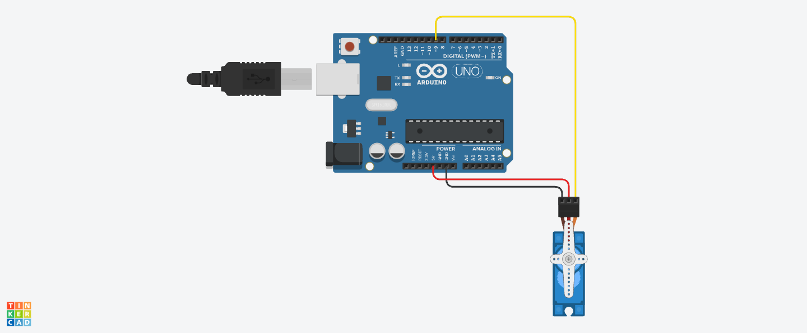

# Secure-Attendance-System

An intelligent attendance system that combines facial recognition with automated door access control. It uses computer vision to identify authorized personnel, maintains attendance records in real-time, and controls physical access through an Arduino-based door mechanism.

 <!-- You can add this later -->

## 🌟 Features

- **Face Recognition**: Automated personnel identification
- **Attendance Tracking**: Real-time Excel-based attendance logging
- **Access Control**: Automated door control via Arduino
- **User Management**: Easy addition of new authorized personnel
- **Security**: Prevents duplicate entries and unauthorized access

## 🔧 Hardware Requirements

- Webcam/USB Camera
- Arduino Uno/Nano
- SG90 Servo Motor
- USB Cable for Arduino
- Basic wiring components

## 📝 Circuit Diagram



The servo motor is connected to:
- Pin 9 (PWM) for signal
- 5V for power
- GND for ground

## 🚀 Installation

1. **Clone the repository**
```bash
git clone https://github.com/agneya-1402/Sesucre-Attendance-System.git
cd Sesucre-Attendance-System
```

2. **Create a virtual environment**
```bash
python -m venv venv
source venv/bin/activate  
```

3. **Install dependencies**
```bash
brew install cmake
brew install dlib
CFLAGS="-stdlib=libc++" 
```

## 📁 Project Structure

```
faceguard/
│
├── known_faces/          # Store authorized personnel images
├── circuit/             # Arduino circuit diagrams
├── src/                 # Source code
    ├── main.py         # Main Python script
    └── Attendance_1.ino # Arduino servo control code

```

## ⚙️ Setup

1. **Arduino Setup**
   - Upload `Attendance_1.ino` to your Arduino board
   - Connect servo motor to Pin 9
   - Note down the COM port/device path

2. **System Configuration**
   - Add authorized personnel photos to `known_faces/` directory
   - Name photos as `firstname_lastname.jpg`
   - Update Arduino port in `main.py` if necessary

3. **Run the System**
```bash
python src/main.py
```

## 🎮 Usage

1. **Adding New Users**
   - Add clear face photos to `known_faces/` directory
   - Format: `firstname_lastname.jpg`
   - System automatically loads new faces on startup

2. **Taking Attendance**
   - Stand in front of camera
   - System automatically:
     - Recognizes face
     - Marks attendance
     - Opens door if authorized

3. **Viewing Attendance**
   - Check `attendance.xlsx` for records
   - Contains name, date, and time of entry

## 📊 Sample Data Format

The attendance.xlsx file follows this structure:

| Name          | Date       | Time     |
|---------------|------------|----------|
| Agneya P.     | 2024-10-22 | 09:00:15 |
| Jane Smith    | 2024-10-22 | 09:15:22 |

## 🔨 Troubleshooting

Common issues and solutions:

1. **Arduino Connection Error**
   - Check USB connection
   - Verify correct COM port/device path
   - Ensure Arduino IDE isn't using the port

2. **Face Recognition Issues**
   - Ensure good lighting
   - Maintain proper distance from camera
   - Check if photo in `known_faces/` is clear


## 🤝 Contributing

1. Fork the repository
2. Create feature branch (`git checkout -b feature/AmazingFeature`)
3. Commit changes (`git commit -m 'Add AmazingFeature'`)
4. Push to branch (`git push origin feature/AmazingFeature`)
5. Open a Pull Request

## 📜 License

Distributed under the MIT License. See `LICENSE` for more information.

## 🙏 Acknowledgments

- OpenCV for computer vision capabilities
- DeepFace for facial recognition
- Arduino community for hardware support
- Anthropic's Claude for development assistance
